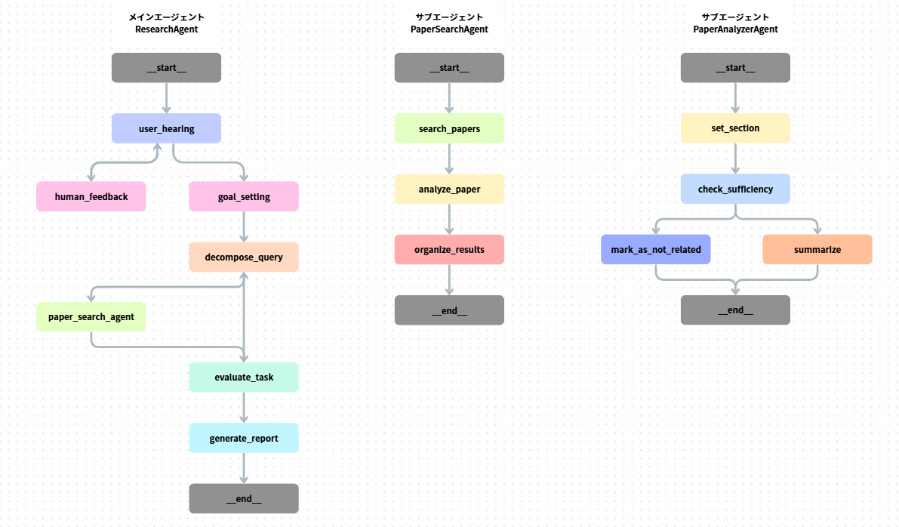

# search_arxiv
論文検索・要約・分析を自動化する LangGraph ベースの AI エージェントです。
arXiv API から論文を取得し、LangChain / LangGraph によってクエリ分解・検索・要約・評価・レポート生成までを自律的に行います。
AI研究者やデータサイエンティストが、最新論文の動向を効率的に把握できることを目的としています。

# Features
### Main Agent
- **research_agent**: 論文研究エージェント。ユーザーが入力したクエリの深堀り、必要なタスクの整理・分解、サブエージェント呼び出し、検索結果評価、レポート生成を担当。
### Sub Agent
- **paper_search_agent**: 論文検索エージェント。タスクに基づいた論文の検索、Cohereによる関連度スコア付け、Jina Reader APIによるMarkdown形式への変換、サブエージェント呼び出し、結果とりまとめを担当。
- **paper_analyzer_agent**: 論文分析エージェント。論文の十分性評価、使用可否判断、タスクに対する回答生成を担当。

# Architecture


# Setup
```bash
# 環境構築
git clone https://github.com/<your name>/AiAgent_SearchArXiv.git
python -m venv .venv
.venv\Scripts\activate
pip install -r requirements.txt

# 各サイトからAPI Keyを取得し.envに環境変数を入れる必要あり
cp .env.sample .env
```

# Run
```bash
# langgraph.jsonを叩きLangGraph Studioを起動
# 事前にLangSmithへの登録が必要
uv run langgraph dev --no-reload
```

# Folder Structure
```
04_AIAGENT_SEARCHARXIV/
├── .env.sample                        # 環境変数のサンプルファイル
├── langgraph.json                     # LangGraph設定ファイル
├── README.md                          # このファイル
├── Dockerfile                         # Docker設定ファイル
├── arxiv_researcher/                  # メインパッケージ
│   ├── __init__.py
│   ├── agent/                         # エージェント実装
│   │   ├── paper_analyzer_agent.py    # 論文分析エージェント
│   │   ├── paper_search_agent.py      # 論文検索エージェント
│   │   └── research_agent.py          # リサーチエージェント（メイン）
│   ├── chains/                        # LangChainチェーン実装
│   │   ├── goal_optimizer_chain.py    # ゴール最適化チェーン
│   │   ├── hearing_chain.py           # ヒアリングチェーン
│   │   ├── paper_processor_chain.py   # 論文処理チェーン
│   │   ├── prompts/                   # プロンプトテンプレート
│   │   ├── query_decomposer_chain.py  # クエリ分解チェーン
│   │   ├── reading_chains.py          # 論文読解チェーン
│   │   ├── reporter_chain.py          # レポート生成チェーン
│   │   ├── task_evaluator_chain.py    # タスク評価チェーン
│   │   └── utils.py                   # ユーティリティ関数
│   ├── logger.py                      # ロガー設定
│   ├── models/                        # データモデル
│   │   ├── __init__.py
│   │   ├── paper_search.py            # メインエージェントモデル
│   │   ├── arxiv.py                   # arXiv関連モデル
│   │   ├── markdown.py                # Markdown関連モデル
│   │   └── reading.py                 # 読解関連モデル
│   ├── searcher/                      # 検索機能
│   │   ├── arxiv_searcher.py          # arXiv検索実装
│   │   └── searcher.py                # 検索インターフェース
│   ├── service/                       # サービス層
│   │   ├── markdown_parser.py         # Markdownパーサー
│   │   ├── markdown_storage.py        # Markdownストレージ
│   │   └── pdf_to_markdown.py         # PDF→Markdown変換
│   └── settings.py                    # 設定ファイル
├── logs/                              # ログファイル保存先
└── storage/                           # ストレージ
    └── png/                           # pngファイル保存先
    └── markdown/                      # 論文のMarkdownファイル保存先
        └── *.md                       # 処理済み論文ファイル
```

# Example
### **入力クエリ**
> AIエージェントについて知りたい

### **Human Feedback**
> 最新の研究動向が知りたい

### **is_related == true となった論文例：**
- 論文A: http://arxiv.org/pdf/2503.12687v1
- 論文B: http://arxiv.org/pdf/2506.00856v2 etc...

### **自動生成レポート（概要）:**
```
AIエージェント研究の最新動向：技術的進展、応用例、および将来の展望

1. 概要

本レポートでは、arXivに掲載された最新の研究論文を基に、AIエージェントに関する研究動向を包括的に分析します。AIエージェントは、大規模言語モデル（LLM）の発展とともに急速に進化し、様々な分野での応用が拡大しています。Krishnan (2025)の研究によれば、AIエージェントは初期の規則ベースのシステムから、知覚、計画、ツール使用のための専用モジュールを統合した現代の洗練されたシステムへと進化しています[1]。本レポートでは、AIエージェントの技術的進展、実世界での応用例、評価方法、そして今後の研究課題について詳細に検討します。


2. 技術的進展

AIエージェントの技術的進展は、主に大規模言語モデル（LLM）の能力向上と、それらを特定のドメインに適応させる手法の発展によって特徴づけられます。


2.1 エージェントアーキテクチャの進化

AIエージェントのアーキテクチャは、単独のLLMから複数のモジュールを統合した複雑なシステムへと進化しています。Liu et al. (2024)によれば、LLMベースのエージェントは、外部リソースやツールを認識し活用する能力を持つことで、単独のLLMよりも汎用性と専門性を大幅に拡張しています[2]。


アーキテクチャの進化段階	特徴	代表的な研究/システム
初期の規則ベースシステム	事前定義されたルールに基づく動作	Russell and Norvig (1995)[1]
LLMを中核とするシステム	言語理解と生成能力の向上	Brown et al. (2020)[3]
モジュール統合型システム	知覚、計画、ツール使用の専用モジュール	Krishnan (2025)[1]
マルチエージェントシステム	複数のエージェント間の協調と相互作用	Wooldridge and Jennings (1995)[1]

2.2 ドメイン特化型AIエージェント
...
```

# Technical Stack
### Core Frameworks
- Python 3.11+
- LangChain / LangGraph

### AI / API Integrations
- OpenAI API
- Anthropic Claude API
- Cohere Rerank API
- Jina Reader API
- arXiv API

### Infrastructure & Tools
- LangGraph Studio (workflow visualization & runtime inspection)
- Docker

# Future Plan / TODO
- [x] 再帰処理を自己修正に変換する
- [ ] 自己修正の精度向上と検索内容の柔軟性確保
- [ ] スケール化するためのDB接続
- [ ] コーパスに含まれない論文以外に関する情報を取得する
- [ ] Embedding検索機能
- [ ] コスト最適化

# References
- 太田 真人 他 『現場で活用するためのAIエージェント実践入門』 (講談社, 2025)
(https://www.amazon.co.jp/dp/4065401402)